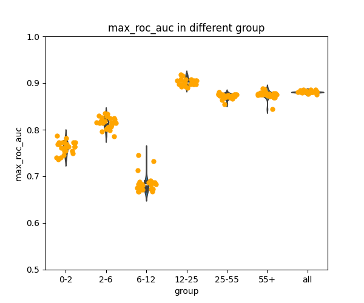

```bash
conda activate nni
cd /root/ClinicalXgboost
```

# weights and topn strategy


## nni1 
data: feature engineering with min max avg of all records

feature derivation and selection: none

code: old code with some error regarding imputation

#### nni1 params generation and importance
```bash
# nni and determine top variables with importance 
nnictl create --config config_nni1.yml --port 8081 # ZpoUyrIC  nnictl resume ZpoUyrIC --port 8081
for expid in nni1_explog/*; do python3 importance.py --nnidir $expid --metric default --minimize True --number_of_trials 7; done
for expid in nni1_explog/*; do python3 importance.py --nnidir $expid --metric default --minimize True --number_of_trials 25; done

```
#### grouping experiments and importance summary based on nni1
```bash
# Loop through YAML files and run train_grouping.py for each experiment
for yml in grouping_nni1_*.yaml; do
    for expid in nni1_explog/*; do
        base_expid=$(basename "$expid")
        python3 train_grouping.py --config "$yml" --expid "$base_expid"
    done
done

# Run importance.py for each grouping experiment folder
for expid in nni1_explog/*; do
    base_expid=$(basename "$expid")  # Extract base experiment ID
    for grfolder in gr_explog/${base_expid}*; do
        python3 importance.py --grdir "$grfolder"
    done
done
```
## nni2

data: feature engineering with min max avg of all records

feature derivation and selection: dv based on ZpoUyrIC_default_top7_fromnni1 feature_importance_summary

code: old code with some error regarding imputation

### nni2 params generation and importance
```bash 
# nni with derived variables nni2_explog derived variables was from top 15 variables ranked by importance in nni1
nnictl create --config config_dv.yml --port 8081 # 3eQbjfcG  nnictl resume 3eQbjfcG --port 8081
for expid in nni2_explog/*; do python3 importance.py --nnidir $expid --metric default --minimize True --number_of_trials 7; done
for expid in nni2_explog/*; do python3 importance.py --nnidir $expid --metric default --minimize True --number_of_trials 25; done
```
### grouping experiments and importance summary based on nni2
```bash
# Loop through YAML files and run train_grouping.py for each experiment
for yml in grouping_nni2_*.yaml; do
    for expid in nni2_explog/*; do
        base_expid=$(basename "$expid")
        python3 train_grouping.py --config "$yml" --expid "$base_expid"
    done
done

# Run importance.py for each grouping experiment folder
for expid in nni2_explog/*; do
    base_expid=$(basename "$expid")  # Extract base experiment ID
    for grfolder in gr_explog/${base_expid}*; do
        python3 importance.py --grdir "$grfolder"
    done
done
```

## nni3
data: feature engineering with min max avg of all records

feature derivation and selection: dv based on ZpoUyrIC_default_top7_fromnni1 feature_importance_summary topn is provided in searchspace for nni3

code: old code with some error regarding imputation

### nni3 params generation and importance

```bash
# nni with derived variables and topn nni3_explog derived variables was from top 15 variables ranked by importance in nni2 and topn is in searchspace for nni3 
nnictl create --config config_dv_topn.yml --port 8081 # 
for expid in nni3_explog/*; do python3 importance.py --nnidir $expid --metric default --minimize True --number_of_trials 7; done
for expid in nni3_explog/*; do python3 importance.py --nnidir $expid --metric default --minimize True --number_of_trials 25; done
```

### grouping experiments and importance summary based on nni3

```bash
# Loop through YAML files and run train_grouping.py for each experiment
for yml in grouping_nni3_*.yaml; do
    for expid in nni3_explog/*; do
        base_expid=$(basename "$expid")
        python3 train_grouping.py --config "$yml" --expid "$base_expid"
    done
done

# Run importance.py for each grouping experiment folder
for expid in nni3_explog/*; do
    base_expid=$(basename "$expid")  # Extract base experiment ID
    for grfolder in gr_explog/${base_expid}*; do
        python3 importance.py --grdir "$grfolder"
    done
done
```


## nni4
data: feature engineering with min max avg of all records

feature derivation and selection:  topn is provided in searchspace for nni4

code: old code with some error regarding imputation

### nni4 params generation and importance   
```bash
# nni with topn nni4_explog topn is in searchspace for nni4 no derived variables
nnictl create --config config_topn.yml --port 7860
for expid in nni4_explog/*; do python3 importance.py --nnidir $expid --metric default --minimize True --number_of_trials 7; done
for expid in nni4_explog/*; do python3 importance.py --nnidir $expid --metric default --minimize True --number_of_trials 25; done
```

### grouping experiments and importance summary based on nni4
```bash
# Loop through YAML files and run train_grouping.py for each experiment
for yml in grouping_nni4_*.yaml; do
    for expid in nni4_explog/*; do
        base_expid=$(basename "$expid")
        python3 train_grouping.py --config "$yml" --expid "$base_expid"
    done
done

# Run importance.py for each grouping experiment folder
for expid in nni4_explog/*; do
    base_expid=$(basename "$expid")  # Extract base experiment ID
    for grfolder in gr_explog/${base_expid}*; do
        python3 importance.py --grdir "$grfolder"
    done
done
```


some notification regarding different experiment id in nni3 and nni4 

have different topn values in searchspace

SyguB7Fb  n60M47dW topn 参数 50-200 

0T2GXABC  lcMYyo0V topn 参数 0.1-1

```bash
# to run importance for all gr_explog
for grfolder in gr_explog/*; do
    python3 importance.py --grdir "$grfolder"
done
```
## conclusion
summary it shows no benefit of feature derivation and subsequent topn selection

[/root/ClinicalXgboost/VariablesImportance/summary.md](/root/ClinicalXgboost/VariablesImportance/summary.md)

use nni1 results for further analysis


# try different grouping strategies

```bash
for yml in grouping_nni1_*_gr2.yaml; do
    for expid in nni1_explog/*; do
        base_expid=$(basename "$expid")
        python3 train_grouping.py --config "$yml" --expid "$base_expid"
    done
done

for expid in nni1_explog/*; do
    base_expid=$(basename "$expid")  # Extract base experiment ID
    for grfolder in gr_explog/${base_expid}*_gr2; do
        python3 importance.py --grdir "$grfolder"
    done
done

```
## conclusion
results show the previous grouping strategy is better

# try boruta

```bash
python3 runboruta.py
```

## conclusion

during boruta discover problem with imputation about to run nni1 again and grouping and importance not done

BORUTA shows good performance in feature selection   

# workflow based on boruta selected features derived variables and selection

## feature engingeering with minmxavg and acute chronic avg
done in sqlquery and saved in csv

dataforxgboost_ac.csv

## nni5
data: feature engineering with min max avg of all records and avg of acute and chronic records
feature derivation and selection: none
code: updated code

### nni5 params generation and importance
```bash
# nni5 GET best params for boruta
nnictl create --config config_nni5.yml --port 8081 # ZpoUyrIC  nnictl resume ZpoUyrIC --port 8081
# run importance for nni5
for expid in nni5_explog/*; do python3 importance.py --nnidir $expid --metric default --minimize True --number_of_trials 7; done

```
experiment id BD3oGFia
newsqlquery  experiment id 8Y9XvkQq

### boruta selection with no derived features
```bash
best_expid=8Y9XvkQq
best_db_path=nni5_explog/$best_expid/db/nni.sqlite
python3 runboruta.py --filepath output/dataforxgboost_ac.csv --best_db_path $best_db_path --target_column VisitDuration --log_dir boruta_explog --groupingparams groupingsetting.yml 
```
experiment id 09647097
newsqlquery experiment id d2d8b927-0e09-44f5-890b-3016f1ea5d68


### boruta selection with derived features from selection using id 09647097
```bash 
best_expid=BD3oGFia
best_db_path=nni5_explog/$best_expid/db/nni.sqlite
python3 runboruta.py --filepath output/dataforxgboost_ac.csv --target_column VisitDuration --log_dir boruta_explog --groupingparams groupingsetting.yml --best_db_path $best_db_path --features_for_derivation boruta_explog/09647097-60b1-4c47-bc04-47eb678f73ea/confirmed_vars.txt
```

### retry boruta selection with derived features with larger number of iterations
```bash
best_expid=BD3oGFia
best_db_path=nni5_explog/$best_expid/db/nni.sqlite
python3 runboruta.py --filepath output/dataforxgboost_ac.csv --target_column VisitDuration --log_dir boruta_explog --groupingparams groupingsetting.yml --best_db_path $best_db_path --features_for_derivation boruta_explog/09647097-60b1-4c47-bc04-47eb678f73ea/confirmed_vars.txt --max_iteration 100
```

## conclusion
boruta select less features with derived features

no derived features were selected by boruta 

```bash
2024-09-13 14:06:23.031 | INFO     | __main__:load_feature_list_from_boruta_file:490 - Found 42 common variables in all the lists
boruta selection with no derived features
['PlateletCount', 'MeanCorpuscularHemoglobinConcentration', 'AntiJo1', 'AbsoluteEosinophilCount', 'AntiScl70', 'CReactiveProtein', 'BasophilsPercentage', 'Histone', 'Plateletcrit', 'LymphocytesPercentage', 'TotalThyroxine', 'MeanPlateletVolume', 'EosinophilsPercentage', 'MeanCorpuscularHemoglobin', 'AntiDoubleStrandedDNA', 'DogDander', 'AntiSSA', 'WhiteBloodCellCount', 'ProliferatingCellNuclearAntigen', 'SMRNP', 'EggWhite', 'RedCellDistributionWidth', 'TotalTriiodothyronine', 'AbsoluteNeutrophilCount', 'ThyroidStimulatingHormone', 'Ragweed', 'MeanCorpuscularVolume', 'NeutrophilsPercentage', 'RedCellDistributionWidthCV', 'Hemoglobin', 'MonocytesPercentage', 'AbsoluteLymphocyteCount', 'AbsoluteMonocyteCount', 'AntiM2', 'AbsoluteBasophilCount', 'FreeThyroxine', 'AntiSM', 'EosinophilCountAbsolute', 'Cockroach', 'ImmunoglobulinE', 'Ro52', 'PlateletDistributionWidth']

2024-09-13 14:06:23.036 | INFO     | __main__:load_feature_list_from_boruta_file:490 - Found 26 common variables in all the lists
boruta selection with derived features
['PlateletCount', 'MeanCorpuscularHemoglobinConcentration', 'AbsoluteEosinophilCount', 'AntiScl70', 'BasophilsPercentage', 'LymphocytesPercentage', 'TotalThyroxine', 'MeanPlateletVolume', 'EosinophilsPercentage', 'MeanCorpuscularHemoglobin', 'DogDander', 'ProliferatingCellNuclearAntigen', 'TotalTriiodothyronine', 'AbsoluteNeutrophilCount', 'Ragweed', 'MeanCorpuscularVolume', 'NeutrophilsPercentage', 'Hemoglobin', 'MonocytesPercentage', 'AbsoluteLymphocyteCount', 'AbsoluteMonocyteCount', 'AntiM2', 'AbsoluteBasophilCount', 'EosinophilCountAbsolute', 'ImmunoglobulinE', 'PlateletDistributionWidth']

2024-09-13 14:06:23.039 | INFO     | __main__:load_feature_list_from_boruta_file:490 - Found 19 common variables in all the lists
boruta selection with derived features try2
['PlateletCount', 'MeanCorpuscularHemoglobinConcentration', 'AbsoluteEosinophilCount', 'AntiScl70', 'BasophilsPercentage', 'LymphocytesPercentage', 'MeanPlateletVolume', 'EosinophilsPercentage', 'MeanCorpuscularHemoglobin', 'DogDander', 'ProliferatingCellNuclearAntigen', 'AbsoluteNeutrophilCount', 'Ragweed', 'MeanCorpuscularVolume', 'MonocytesPercentage', 'AbsoluteLymphocyteCount', 'AntiM2', 'AbsoluteBasophilCount', 'PlateletDistributionWidth']

2024-09-13 15:21:49.931 | INFO     | __main__:load_feature_list_from_boruta_file:490 - Found 30 common variables in all the lists
boruta selection with derived features try with maxiteration 100
['AbsoluteLymphocyteCount', 'ImmunoglobulinE', 'MeanPlateletVolume', 'AbsoluteNeutrophilCount', 'NeutrophilsPercentage', 'Hemoglobin', 'ThyroidStimulatingHormone', 'WhiteBloodCellCount', 'CReactiveProtein', 'MeanCorpuscularHemoglobinConcentration', 'AbsoluteBasophilCount', 'DogDander', 'Ragweed', 'Cockroach', 'EosinophilCountAbsolute', 'EosinophilsPercentage', 'LymphocytesPercentage', 'AntiM2', 'MonocytesPercentage', 'PlateletCount', 'Plateletcrit', 'PlateletDistributionWidth', 'MeanCorpuscularVolume', 'AntiScl70', 'MeanCorpuscularHemoglobin', 'AbsoluteMonocyteCount', 'ProliferatingCellNuclearAntigen', 'TotalTriiodothyronine', 'AbsoluteEosinophilCount', 'BasophilsPercentage']
```

# workflow based on different feature engineering and boruta selection 

feature engineering

nni5: feature engineering with min max avg of acute and chronic records

nni6: feature engineering with min max avg of acute records only

nni7: feature engineering with min max avg of all records

nni8: feature engineering with min max avg of acute records and preclinical records

## nni5

data: feature engineering with min max avg of all records and avg of acute and chronic records

feature derivation and selection: none

code: updated code

### reuse the results of nni5 BD3oGFia
 
### reuse boruta results from nni5 09647097


### group training with nni5 results and with nni5 results + bselected features
```bash
for yml in grouping_nni5*.yaml; do
    for expid in nni5_explog/*; do
        base_expid=$(basename "$expid")
        python3 train_grouping.py --config "$yml" --expid "$base_expid"
    done
done
```


### Run importance.py for each grouping experiment folder
```bash
for expid in nni5_explog/*; do
    base_expid=$(basename "$expid")  # Extract base experiment ID
    for grfolder in gr_explog/${base_expid}*; do
        python3 importance.py --grdir "$grfolder"
    done
done
```
|nni|nni+boruta|
|---|---|
|||


## nni6

data: feature engineering with min max avg of acute records only

feature derivation and selection: none

code: updated code

### nni6 params generation and importance
```bash
nnictl create --config config_nni6.yml --port 8081 # ZpoUyrIC  nnictl resume ZpoUyrIC --port 8081
# run importance for nni6
for expid in nni6_explog/*; do python3 importance.py --nnidir $expid --metric default --minimize True --number_of_trials 7; done
```
experiment id 4jmrxVsX

results of acute data prediction was bad roc was about 0.6

### run boruta for nni6
```bash
best_expid=4jmrxVsX
best_db_path=nni6_explog/$best_expid/db/nni.sqlite
python3 runboruta.py --filepath output/dataforxgboost_a.csv --best_db_path $best_db_path --target_column VisitDuration --log_dir boruta_explog --groupingparams groupingsetting.yml
```
experiment id bc631828


### group training with nni6 results and with nni6 results + bselected features
```bash
for yml in grouping_nni6*.yaml; do 
    for expid in nni6_explog/*; do
        base_expid=$(basename "$expid")
        python3 train_grouping.py --config "$yml" --expid "$base_expid"
    done
done
```

### Run importance.py for each grouping experiment folder
```bash
for expid in nni6_explog/*; do
    base_expid=$(basename "$expid")  # Extract base experiment ID
    for grfolder in gr_explog/${base_expid}*; do
        python3 importance.py --grdir "$grfolder"
    done
done
```

|nni|nni+boruta|
|---|---|
|||
## nni7

data: feature engineering with min max avg of all records
feature derivation and selection: none
code: updated code

### nni7 params generation and importance
```bash
# nni7 use original min max avg data like nni1 but with new code
nnictl create --config config_nni7.yml --port 8081 # ZpoUyrIC  nnictl resume ZpoUyrIC --port 8081
# run importance for nni7
for expid in nni7_explog/*; do python3 importance.py --nnidir $expid --metric default --minimize True --number_of_trials 7; done

```
experiment id Itr01zQY

### boruta selection with nni7 results
```bash
best_expid=Itr01zQY
best_db_path=nni7_explog/$best_expid/db/nni.sqlite
python3 runboruta.py --filepath output/dataforxgboost.csv --best_db_path $best_db_path --target_column VisitDuration --log_dir boruta_explog --groupingparams groupingsetting.yml
```

experiment id 57d5c9dd


### group training with nni7 results and with nni7 results + bselected features
```bash
for yml in grouping_nni7*.yaml; do
    for expid in nni7_explog/*; do
        base_expid=$(basename "$expid")
        python3 train_grouping.py --config "$yml" --expid "$base_expid"
    done
done
```

### Run importance.py for each grouping experiment folder
```bash
for expid in nni7_explog/*; do
    base_expid=$(basename "$expid")  # Extract base experiment ID
    for grfolder in gr_explog/${base_expid}*; do
        python3 importance.py --grdir "$grfolder"
    done
done
```
|nni|nni+boruta|
|---|---|
|||

## nni8

data: feature engineering with min max avg of acute records and preclinical records

feature derivation and selection: none

code: updated code

### nni8 params generation and importance
```bash
# nni8 use acute data and preclinical data
nnictl create --config config_nni8.yml --port 8081 # ZpoUyrIC  nnictl resume ZpoUyrIC --port 8081
for expid in nni8_explog/*; do python3 importance.py --nnidir $expid --metric default --minimize True --number_of_trials 7; done
```
experiment id AhUO5lFk

### boruta selection with nni8 results
```bash
# run boruta for nni8
best_expid=AhUO5lFk
best_db_path=nni8_explog/$best_expid/db/nni.sqlite
python3 runboruta.py --filepath output/dataforxgboost_ap.csv --best_db_path $best_db_path --target_column VisitDuration --log_dir boruta_explog --groupingparams groupingsetting.yml
```

experiment id 6a7a1e15

### group training with nni8 results and with nni8 results + bselected features
```bash
for yml in grouping_nni8*.yaml; do
    for expid in nni8_explog/*; do
        base_expid=$(basename "$expid")
        python3 train_grouping.py --config "$yml" --expid "$base_expid"
    done
done
```

### Run importance.py for each grouping experiment folder
```bash
for expid in nni8_explog/*; do
    base_expid=$(basename "$expid")  # Extract base experiment ID
    for grfolder in gr_explog/${base_expid}*; do
        python3 importance.py --grdir "$grfolder"
    done
done
```
|nni|nni+boruta|
|---|---|
|||


## add data save code in train grouping code rerun all grouping yaml

```bash

for yml in grouping_nni*.yaml; do 
    python3 train_grouping.py --config "$yml"
done

```

## change preprocessor setting so the dropna threshold of commonbloodtest is 50% 

### rerun all nni and check available data amount

#### nni5
```bash
nnictl create --config config_nni5.yml --port 8081 
nnictl resume CFBmkWQ1 --port 8081 
```
experiment id: CFBmkWQ1

boruta
```bash
best_expid=CFBmkWQ1
best_db_path=nni5_explog/$best_expid/db/nni.sqlite
python3 runboruta.py --filepath output/dataforxgboost_ac.csv --best_db_path $best_db_path --target_column VisitDuration --log_dir boruta_explog --groupingparams groupingsetting.yml 
```
Experiment name: e5a86e18-dca6-49d1-a9c5-4955afa26f84


##### nni6
```bash
nnictl create --config config_nni6.yml --port 7860
```
The experiment id is ia27HVx6
```bash
best_expid=ia27HVx6
best_db_path=nni6_explog/$best_expid/db/nni.sqlite
python3 runboruta.py --filepath output/dataforxgboost_a.csv --best_db_path $best_db_path --target_column VisitDuration --log_dir boruta_explog --groupingparams groupingsetting.yml
```
 Experiment name: aa54898a-5bf4-419f-8422-4c4e91de67d2


#### nni7
```bash
nnictl create --config config_nni7.yml --port 8000 
```
The experiment id is kiGBxqL6
```bash
best_expid=kiGBxqL6
best_db_path=nni7_explog/$best_expid/db/nni.sqlite
python3 runboruta.py --filepath output/dataforxgboost.csv --best_db_path $best_db_path --target_column VisitDuration --log_dir boruta_explog --groupingparams groupingsetting.yml
```

#### nni8 
```bash
nnictl create --config config_nni8.yml --port 6666 
```
The experiment id is agAUczMO
```bash
best_expid=agAUczMO
best_db_path=nni8_explog/$best_expid/db/nni.sqlite
python3 runboruta.py --filepath output/dataforxgboost_ap.csv --best_db_path $best_db_path --target_column VisitDuration --log_dir boruta_explog --groupingparams groupingsetting.yml
```

### rerun all grouping
```bash
for yml in grouping_nni*.yaml; do 
    python3 train_grouping.py --config "$yml"
done
```